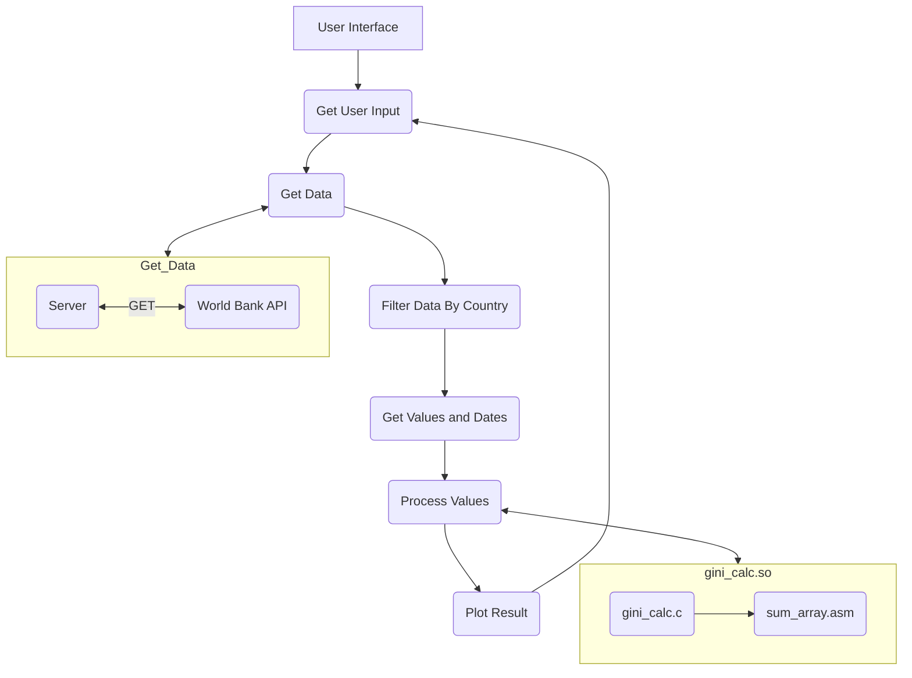

# TP1

## Implemetación

Se trata de un desarrollo por capas, en primera instancia se levanta un programa en **python** que utilizando la biblioteca *requests* hace una peticion del tipo **GET** a una [API publica](https://api.worldbank.org/v2/en/country/all/indicator/SI.POV.GINI?format=json&date=2011:2020&per_page=32500&page=1&country=%22Argentina%22). La respuesta se procesa y se convierte en un objeto json el cual se filtra para obtener los datos del indice gene del pais de interes (Argentina). Esta lista filtrada se pasa posteriormente convierte a un arreglo de C utilizando la libreria de *ctypes* que permite realizar la conversion de tipos de datos de python a tipos de dato aceptables para C. Con esto se puede proceder a utilizar las funciones de la libreria desarrollada en C que a su vez se compila con codigo desarrollado en assembler usando convenciones de llamadas. Esta libreria carga los valores en un arreglo el cual despues es graficado en python usando la libreria *matplotlib*. 

Todo esto se complementa con una capa superior de interaz de usuario que permite usar el programa de una manera intuitiva y amigable.

### Diagrama de Bloques




### Diagrama de Secuencia


## Instrucciones de Uso

### Compilación codigo C para crear libreria compartida
- Crear objeto del codigo de assembler: (compilar para 32 bits)
```sh
nasm -f elf32 sum_array.asm
```
- Compilar driver de C y crear libreria compartida (compilacion de 32 bits):
```sh
gcc -shared -W -o libgini_calc.so sum_array.o -m32 gini_calc.c
```

O para correr el test de C:
```sh
nasm -f elf32 sum_array.asm 
gcc -o prueba sum_array.o -m32 gini_calc.c 
./prueba
```

### Instalar Librerias de Python
Para correr python con un programa en C compilado para 32 bits, es necesario utilizar una entorno de python tambien de 32 bits.

- Instalar [miniconda](https://docs.anaconda.com/free/miniconda/)
```sh
mkdir -p ~/miniconda3
wget https://repo.anaconda.com/miniconda/Miniconda3-latest-Linux-x86_64.sh -O ~/miniconda3/miniconda.sh
bash ~/miniconda3/miniconda.sh -b -u -p ~/miniconda3
rm -rf ~/miniconda3/miniconda.sh--override-channels
```
- Después de la instalación, inicialice su Miniconda. Los siguientes comandos se inicializan para los shells bash y zsh:
```sh
eval "$(~/miniconda3/bin/conda shell.bash hook)"
```
o para iniciar siembre con el entorno de conda
```sh
~/miniconda3/bin/conda init bash
~/miniconda3/bin/conda init zsh
```
- Instalar entorno de py32:
```sh
conda create -n py32 python=3.7 -c https://repo.anaconda.com/pkgs/main/linux-32/ --override-channels
```
- Activar entorno de py32:
```sh
conda activate py32
```
- Instalar libc11-6 (32 bits):
```sh
sudo apt-get install libx11-6:i386
```
- Actualizar pip:
```sh
pip install --upgrade pip
```
- Instalar librerias necesarias para el programa:
```sh
pip install numpy requests matplotlib
```
- Libreria para correr tests de python:
```sh
pip install pytest
```

### Ejecutar programa de Python

```sh
python main.py
```

## Resultados
### Graficos


### Interfaz de Usuario
Se ve el funcionamiento del programa desde el punto de vista del usuario, en la cual 
usamos una interfaz visual creada desde python.

Al abrir el programa el boton "mostrar grafico" se encuentra desactivado ya que se pide la seleccion de un pais para generar el mismo.


Al realizar el despliegue de la lista de paises disponibles se puede seleccionar directamente el pais deseado o se puede opar por filtrar por letra. (Si el pais escrito no existe no se muestra y se desactiva el boton).


Al seleccionar el pais deseado se activa el boton


Al precionar el boton se genera el grafico en una ventana particular


## Codigo de Assembly

```asm
;
; initialized data is put in the .data segment
;
segment .data


;
; uninitialized data is put in the .bss segment
;
segment .bss

;
; code is put in the .text segment
;
segment .text
        global  _sum_array
_sum_array: 
        ; void _sum_array(float* input, int size, int* output);
        ; [ebp + 8] = int* input
        ; [ebp + 12] = int size
        ; [ebp + 16] = int* output
        push ebp                ; guardar base pointer anterior en el stack
        mov ebp, esp            ; ebp = esp

        mov eax, [ebp+8]        ; eax = float* input
        mov ecx, [ebp+16]       ; ecx = int* output
        mov edx, 0              ; edx = i = 0

for_loop:
        cmp edx, [ebp+12]       ; comparar i con size
        jge end_loop            ; jump if (edx) greater or equal (ebp+12) = jump if i >= size

        fld dword [eax+edx*4]   ; guardar float en la pila de la FPU
        fistp dword [ecx+edx*4] ; pasamos a entero y guardamos en output[i]
        inc dword [ecx+edx*4]  ; output[i] += 1

        inc edx                ; i++
        jmp for_loop

end_loop:

        mov esp, ebp           ; vuelvo esp a ebp
        pop ebp                ; recupero ebp anterior
        ret
```

## Tests

### Medida de Performance
Se utiliza timestamps al inicio y al final de la funcion de procesamiento de los datos desde python para tener una idea del tiempo que toma la funcion:

- Usando llamada a C con codigo en assembly:


- Usando codigo en python truncando a entero:


- Usando codigo en python pero redondeando:


Se observa que el codigo en python es mas rapido al procesar los datos. esto se debe a que llamar la libreria de C desde python lleva mucho tiempo en relacion a los calculos que se deben hacer.  
Si ahora se lleva a cabo la misma prueba pero con un arreglo de mayor tamano como entrada a la funcion, se obtienen los siguientes resultados:


Ahora si, vemos como es mas rapida en gran medida la funcion en assembler a comparacion con la funcion en python.

### Prueba test función Assembler

Se llama a la funcion de assembler desde C pasando un arreglo de numeros para ver como
se comporta la funcion y que valores que retorna sean los correctos.


Resultados de la ejecución:


### Tests Unitarios con pytest

Se prueban todas las funciones relativas al fetching de datos y manipulacion de los mismos.
Para correr los tests unitarios de python correr pytest en el directorio raiz:
```sh
pytest
```


### GDB

- Compilar el programa con la opción de depuración (con la flag -g):
```sh
gcc -g -o prueba sum_array.o -m32 gini_calc.c 
```
- Correr gdb:
```sh
gdb prueba
```
- Se debe colocar un break point en el punto donde se quiere arrancar el debug:
```sh
break _sum_array
```
En este caso se realiza el siguiente debug:

- Antes de iniciar el debug del programa se puede listar las instrucciones que se ejecutarán en el programa:


- Una vez listadas las instrucciones se procede a colocar los breakpoints en las instrucciones las intrucciones deseadas:


- Al observar la pila desde la direccion de la primer variable podemos observar los valores de los siguientes datos:


En la imagen observamos que los primeros (12 bytes corresponden a los valores flotantes del vector antes declarado y los siguientes 12 bytes al vector de enteros inicializados en 0)

- Se debe ir paso por paso con la instrucción nexti se vera lo siguiente:


En donde podemos observar que se ingresa al bucle creado en el programa de assembler y se guarda en la pila la direccion de retorno.

